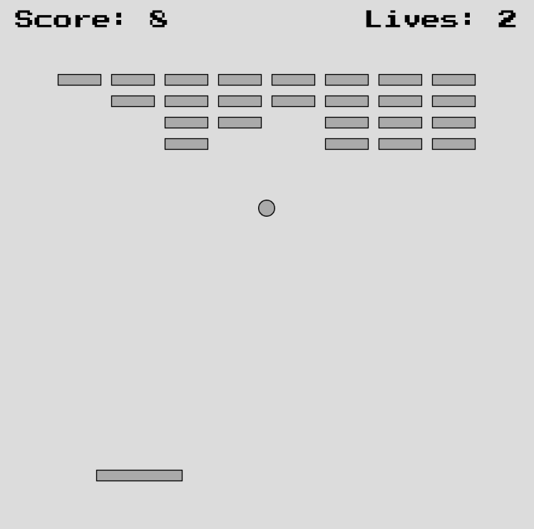

# Cinder Block Breaker

Cinder Block Breaker is a game in which the goal is for the player to destroy as many cinder blocks as possible by deflecting a ball with a paddle. 

## Outline

- [Objects](#objects)
    - [Cinder Blocks](#cinder-blocks)
    - [Ball](#ball)
    - [Paddle](#paddle)
- [Mechanics](#mechanics)
    - [Score](#score)
    - [Lives](#lives)
    - [Physics](#physics)
- [Components](#components)
    - [Graphics](#graphics)
    - [Sound](#sound)
    - [Hardware](#hardware)
- [Future Development](#future-development)

## Objects

### Cinder Blocks

Cinder blocks are represented as 40x10 gray rectangles. Every 60 seconds, the cinder blocks are reset, recreating an 8x3 grid of blocks near the top of the screen. 

When a block is destroyed, the player’s score will increase by 1. 

### Ball

The ball must be used to destroy the cinder blocks.
When the ball collides with a cinder block, it will bounce away, destroying the block in the process.

The ball can also bounce off the left, right and top boundaries of the screen. The ball does not bounce off the bottom of the screen. It will instead leave the screen, decreasing the number of lives by 1. Shortly after, a new ball will spawn to replace it. 

The ball can bounce off the top of the paddle, which is the primary mechanism for controlling the ball. 

### Paddle

The paddle is the primary mechanism for controlling the ball and is represented as a rectangular object near the bottom of the screen.
The paddle can move left and right as controlled by the player by using a joystick. 

When the ball strikes the top of the paddle, the ball will launch upwards.
The ball will also move left or right, depending on the location of the paddle that the ball hit. 

## Mechanics

### Score

When a brick is broken, the score will increase by 1. The goal of the game is to attain the highest possible score before the game ends. 

### Lives

The player starts with 3 lives. When the ball leaves the screen (by missing the paddle), the number of lives will decrease by 1. When there are zero lives remaining, the game ends. 

### Physics

The physics of the game is quite simple. The ball is always travelling at the same speed, but it will have different directions at any given time. 

There are three types of collisions: ball collides with cinder block, ball collides with side of screen, and ball collides with paddle. 

In the case of the ball colliding with a cinder block, if the ball hits the left or right side, the ball’s horizontal velocity will change direction. If the ball hits the top or bottom, the vertical velocity will change direction. 

In the case of the ball colliding with the sides of the screen, it will follow the same physics as colliding with a cinder block. 

In the case of the ball colliding with the paddle, it will be different. The ball can only collide with the top of the paddle. When colliding with the top of the paddle, the ball’s velocity will be set upwards. However, the ball can also travel up to 60 degrees to the left or 60 degrees to the right depending on the location of the paddle hit. 

## Components

### Graphics

The graphics of the game are simple.
Cinder blocks are represented as 40x10 gray rectangle.
The paddle is represented as an 80x10 gray rectangle.
The ball is represented as a circle with a radius of15. 

### Sound

There are three sound effects that will be played in the game:
when the ball bounces off a paddle or side of screen,
when the ball bounces off a cinder a block,
and when the player loses a life. 

### Hardware

As described earlier, the paddle is controlled using a joystick.
There are three LEDs that will indicate the number of lives remaining. 

## Future development 

The game could add extra features like a randomized layout of cinder blocks rather than always having an 8x3 grid. 

There could also be powerups, granting temporary effects in the player’s favor such as having an extra ball or a bigger paddle. 

There could also be debuffs, granting temporary effects against the player’s favor such as a slower paddle or a smaller paddle. 

## Video

[video of game](recording.mp4)
